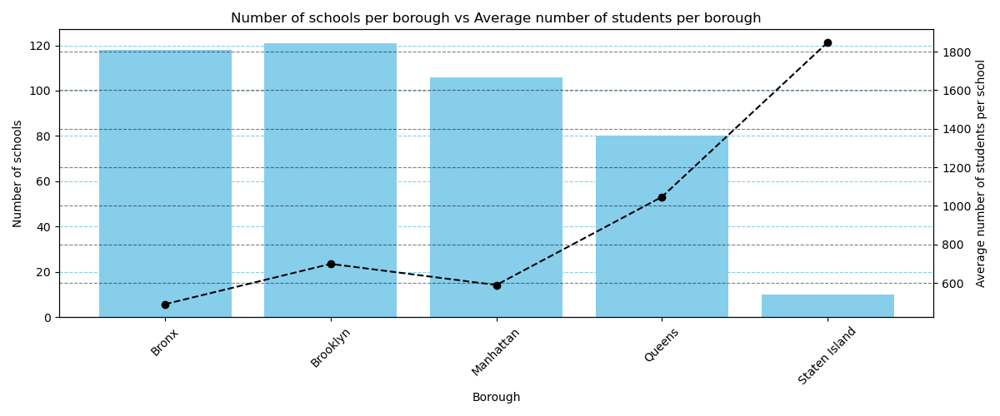

# NYC School Data Analysis & ETL Pipeline

## Project Preview

## 🚀 Project Overview
This project is a comprehensive end-to-end data analysis and engineering initiative using NYC Open Data. It covers the full lifecycle of data—from initial exploratory analysis to building a robust Python-driven ETL pipeline and performing relational database audits.

## 📂 Project Structure
- **[Incident Analysis](./incident_analysis):** Examination of school safety datasets to identify incident patterns, borough-specific distributions, and metadata discrepancies.
- **[Geospatial & Enrollment Exploration](./school_directory_exploration):** Comparative analysis of school structures and student density using Python and Pandas to visualize borough-specific trends.
- **[Relational Database Integration](./database_queries):** Advanced SQL querying to merge demographic data with school directories, including a critical audit of data coverage gaps.
- **[ETL & Database Population](./database_population):** Data engineering workflow to clean, validate, and inject SAT results into a PostgreSQL production environment.

## 🛠️ Tech Stack
- **Languages:** Python (Pandas, SQLAlchemy, Psycopg2)
- **Database:** PostgreSQL
- **Tools:** Jupyter Notebooks, Google Sheets, Bash/CLI

## 💡 Key Highlights
- **Data Engineering:** Architected a pipeline to clean and inject validated SAT scores into custom SQL tables with strict integrity constraints.
- **Analytic Insights:** Uncovered the "Staten Island Model" of high-capacity school hubs and identified significant demographic data gaps in 80% of NYC boroughs.
- **Integrity Focused:** Systematically standardized "dirty" data and audited metadata mismatches to ensure production-ready datasets.
